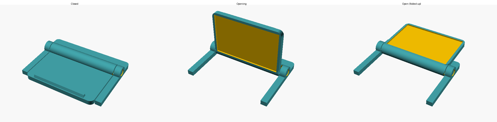

# Leapmotor B05 driver-camera privacy cover

A flip-up lid for the driver-monitoring camera on the left A-pillar. A U-shaped frame is taped to the camera pod. The lid hangs over the lens when closed and folds up 180° onto the frame when open, and it clicks into place in both positions.

It prints **as one piece with the hinge already assembled** (print-in-place). It needs no supports and no assembly.

## Why a flip lid and not a slider

The camera pod is small: about 45 × 28 mm with a 27–28 × 16–17.5 mm window. There's about 9 mm of face above the window and 6–9 mm to its left and right, but only about 2 mm below it. A sliding shutter would stick far out past the pod. A lid hinged on the top edge fits.

## Size (defaults)

| | |
|---|---|
| Frame | 36.9 mm wide, 5.2 mm thick at the hinge, 2 mm elsewhere |
| Lid | covers 31 × 20 mm (window + 1.5 mm overlap) |
| Needs | 9 mm of flat face above the window, ~4.5 mm on each side |

The defaults were estimated from photos with a set square. They're accurate to about ±1.5 mm, so **check with a ruler held flat on the pod** before printing:

- `win_w` / `win_h`: the dark window **including its black rim**
- the space above the window (needs ≥ 9 mm; if less, lower `strip_h`)

## Print (Bambu Lab A1)

- **Black PETG** (or ASA). PLA softens behind a windscreen. Use an opaque dark colour, because the camera uses infrared light.
- 0.2 mm layers, 3 walls, no supports, printed flat as exported.
- After printing, bend the lid gently to break the hinge free.
- If the hinge fuses, raise `g` (0.35 → 0.4). If the click is too stiff or too weak, change `det` (0 = no click).

## Fit

1. Peel off the clear protective film tab on the lens if it's still there.
2. Clean the pod face with isopropyl alcohol.
3. Stick the frame on with **thin foam VHB tape** (~0.8–1 mm) on the strip and both legs. Put the hinge just above the window's top edge.

To change sizes, open `camera-cover.scad` in OpenSCAD (Window → Customizer) or in MakerWorld's Parametric Model Maker. Set `part = preview` and `open_angle` to see it move.

> This is the driver attention/fatigue camera. With the lid closed, the car will probably show a warning or switch off driver-monitoring features.
